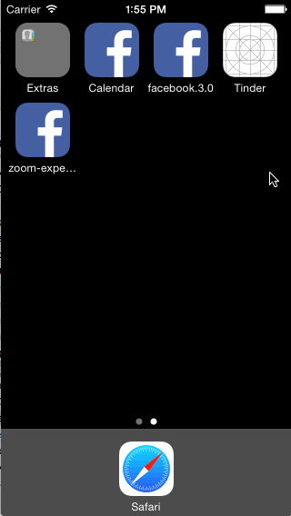

facebook (week 4 assignment)
============

Done:
* Tapping on a photo in the news feed should expand the photo full screen.
* Tapping the Done button should animate the photo back into its position in the news feed.
* On scroll of the full screen photo, the background should start to become transparent, revealing the feed.

Not quite there:
* If the user scrolls a large amount and releases, the full screen photo should dismiss.

Animations to/from the photo view are controlled by the primary VC
Temp image set up, but ran out of time working it
Want control of window over status bar

Total hours: 8-10 (needed another 5 hrs :( ) 

facebook.3.0 (week 1)
============

New and Improved! 

STATUS: 

Looks like everything works *except* animating view on keyboard up.

HOURS WORKED:

~15hrs

NOTES:

Struggled with scrolling for way too long. Had a few friends walk me through the steps. Concepts now a bit clearer to me…once basics groked, felt much easier. Hopefully will continue to clarify as I work more

WALKTHROUGH:

facebook-final.gif
